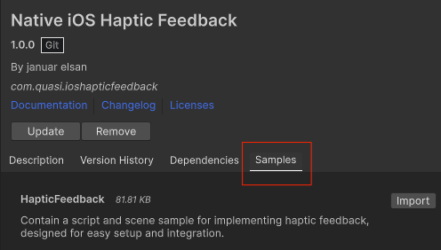

# Native iOS Haptic Feedback Unity

Easily add native haptic feedback to your Unity games or apps using iOS's native haptic capabilities.  

Key Features:
- Simple setup and usage.
- Support for different haptic styles (e.g., light, medium, heavy, rigid, soft, success, warning,error, selection).
- Includes a **sample script** and a **demo scene** to get started quickly.

## Instalation

There are 4 ways to install this plugin:

- Open Package Manager and "Add package from git url..." using:
  
  `https://github.com/januarelsan/Native-iOS-HapticFeedback-Unity.git` 
- Import [Native-iOS-HapticFeedback.unitypackage](https://github.com/januarelsan/Native-iOS-HapticFeedback-Unity/releases) via Assets-Import Package
- Clone/download this repository and move the Plugins folder to your Unity project's Assets folder
- (Via Package Manager) add the following line to Packages/manifest.json:

  `"com.quasi.ioshapticfeedback": "https://github.com/januarelsan/Native-iOS-HapticFeedback-Unity.git"`


## Usage

```csharp
using Quasi.HapticFeedback;
```

```csharp
HapticFeedback.TriggerImpactHaptic(0); // Light
HapticFeedback.TriggerImpactHaptic(1); // Medium
HapticFeedback.TriggerImpactHaptic(2); // Heavy
HapticFeedback.TriggerImpactHaptic(3); // Rigid
HapticFeedback.TriggerImpactHaptic(4); // Soft
HapticFeedback.TriggerNotificationHaptic(0); // Notification Success
HapticFeedback.TriggerNotificationHaptic(1); // Notification Warning
HapticFeedback.TriggerNotificationHaptic(2); // Notification Error
HapticFeedback.TriggerSelectionHaptic(); // Selection
```

## Sample
You can import the sample to get started quickly.



## Other Resources
Learn how the haptic feel works [here](https://developer.apple.com/design/human-interface-guidelines/playing-haptics#Notification).

## Contributing
Contributions are greatly appreciated to help improve this plugin.
